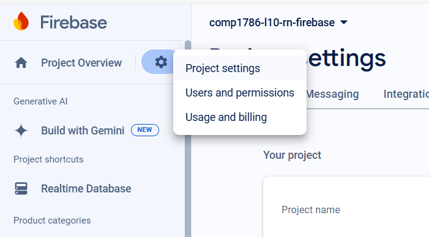
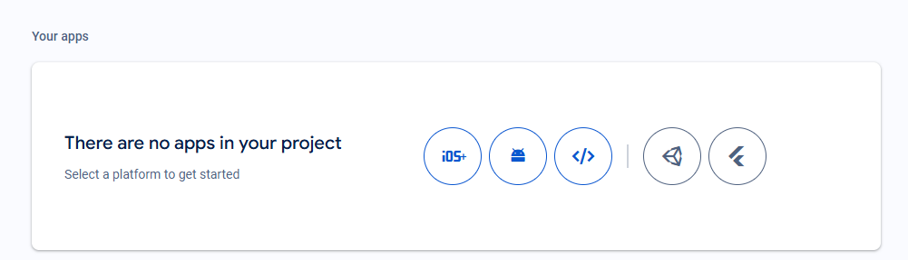
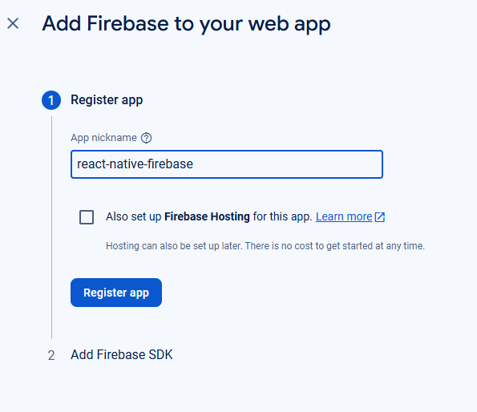
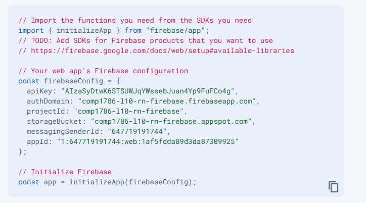
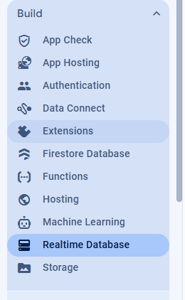
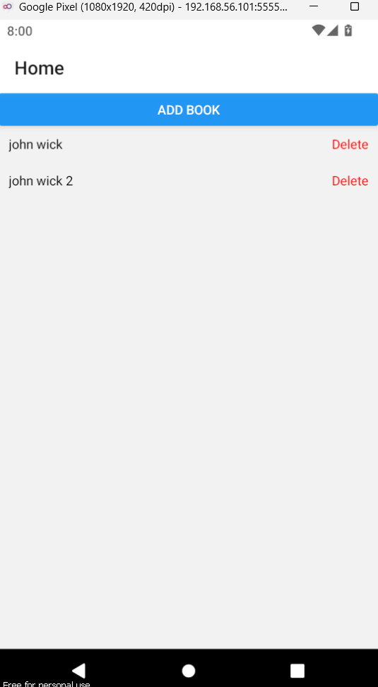
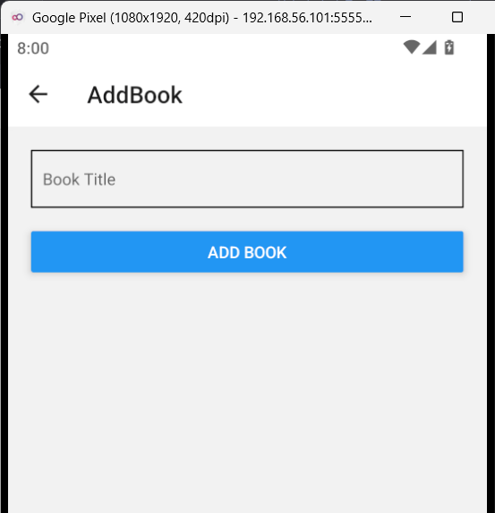
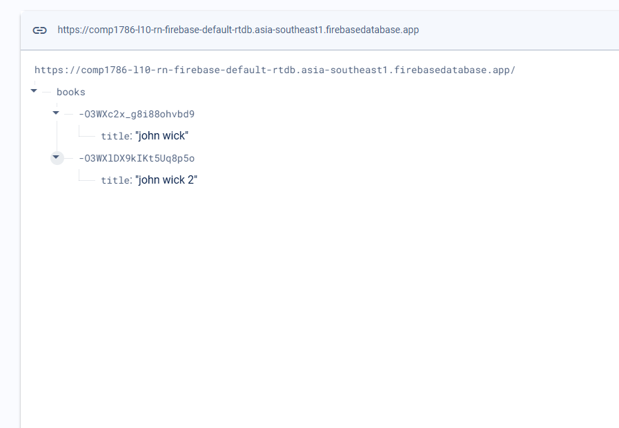

# Lecture 10: React Native with Firebase

### Prerequisites:

1. **Node.js** installed
2. **Expo CLI** installed (`npm install -g expo-cli`)
3. **Firebase project** set up ([https://console.firebase.google.com/]() )

### Step 1: Initialize the Expo Project

First, create a new Expo project:

```bash
npx create-expo-app comp1786-l10-react-native-firebase --template blank BookManager
cd comp1786-l10-react-native-firebase
```

### Step 2: Install Required Dependencies

Install the necessary packages:

```bash
npm install firebase
```

### Step 3: Configure Firebase

Create a file `firebaseConfig.js` and add your Firebase configuration:

```javascript
// firebaseConfig.js
import { initializeApp } from "firebase/app";
import { getDatabase } from "firebase/database";

const firebaseConfig = {
  apiKey: "YOUR_API_KEY",
  authDomain: "YOUR_AUTH_DOMAIN",
  databaseURL: "YOUR_DATABASE_URL",
  projectId: "YOUR_PROJECT_ID",
  storageBucket: "YOUR_STORAGE_BUCKET",
  messagingSenderId: "YOUR_MESSAGING_SENDER_ID",
  appId: "YOUR_APP_ID",
};

const app = initializeApp(firebaseConfig);
const database = getDatabase(app);

export { database };
```

Follow these steps to find the config in Firebase Console

Go to `Project settings`



Then choose `</>`



After the, register the app



Then, you can see the config



Make to create the RealTime Database



### Step 4: Set Up Navigation

Install the React Navigation libraries:

```bash
npm install @react-navigation/native @react-navigation/stack
npm install react-native-screens react-native-safe-area-context
```

Create a `navigation` folder with an `index.js` file to configure navigation:

```javascript
// navigation/index.js
import { NavigationContainer } from "@react-navigation/native";
import { createStackNavigator } from "@react-navigation/stack";
import React from "react";

import AddBookScreen from "../screens/AddBookScreen";
import HomeScreen from "../screens/HomeScreen";

const Stack = createStackNavigator();

export default function AppNavigator() {
  return (
    <NavigationContainer>
      <Stack.Navigator initialRouteName="Home">
        <Stack.Screen name="Home" component={HomeScreen} />
        <Stack.Screen name="AddBook" component={AddBookScreen} />
      </Stack.Navigator>
    </NavigationContainer>
  );
}
```

### Step 5: Create Screens

Create a `screens` folder with two files: `HomeScreen.js` and `AddBookScreen.js`.

#### HomeScreen.js

This screen will list and delete book items:

```javascript
// screens/HomeScreen.js
import { onValue, ref, remove } from "firebase/database";
import React, { useEffect, useState } from "react";
import { Button, FlatList, Text, TouchableOpacity, View } from "react-native";
import { database } from "../firebaseConfig";

export default function HomeScreen({ navigation }) {
  const [books, setBooks] = useState([]);

  useEffect(() => {
    const booksRef = ref(database, "books/");
    onValue(booksRef, (snapshot) => {
      const data = snapshot.val();
      const bookList = data
        ? Object.keys(data).map((key) => ({ id: key, ...data[key] }))
        : [];
      setBooks(bookList);
    });
  }, []);

  const deleteBook = (id) => {
    remove(ref(database, `books/${id}`));
  };

  return (
    <View>
      <Button title="Add Book" onPress={() => navigation.navigate("AddBook")} />
      <FlatList
        data={books}
        keyExtractor={(item) => item.id}
        renderItem={({ item }) => (
          <View
            style={{
              flexDirection: "row",
              justifyContent: "space-between",
              padding: 10,
            }}
          >
            <Text>{item.title}</Text>
            <TouchableOpacity onPress={() => deleteBook(item.id)}>
              <Text style={{ color: "red" }}>Delete</Text>
            </TouchableOpacity>
          </View>
        )}
      />
    </View>
  );
}
```

#### AddBookScreen.js

This screen will handle adding new book items:

```javascript
// screens/AddBookScreen.js
import { push, ref } from "firebase/database";
import React, { useState } from "react";
import { Button, TextInput, View } from "react-native";
import { database } from "../firebaseConfig";

export default function AddBookScreen({ navigation }) {
  const [title, setTitle] = useState("");

  const addBook = () => {
    if (title.trim() === "") {
      alert("Book title cannot be empty!");
      return;
    }
    const booksRef = ref(database, "books/");
    push(booksRef, { title })
      .then(() => {
        navigation.goBack();
      })
      .catch((error) => {
        alert(error.message);
      });
  };

  return (
    <View style={{ padding: 20 }}>
      <TextInput
        placeholder="Book Title"
        value={title}
        onChangeText={(text) => setTitle(text)}
        style={{ borderWidth: 1, padding: 10, marginBottom: 20 }}
      />
      <Button title="Add Book" onPress={addBook} />
    </View>
  );
}
```

### Step 6: Integrate Navigation in App.js

Replace the contents of `App.js` with:

```javascript
import React from "react";
import AppNavigator from "./navigation";

export default function App() {
  return <AppNavigator />;
}
```

### Step 7: Run Your App

Start your Expo project:

```bash
npm start
```

Your application should now allow you to create, list, and delete book items using Firebase Realtime Database.






